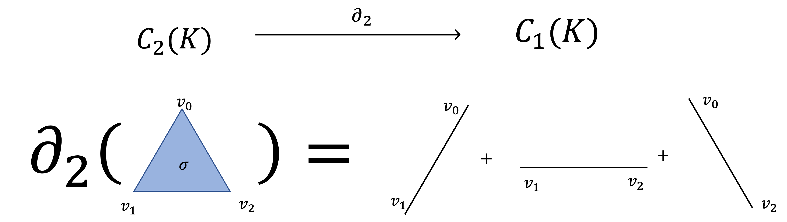
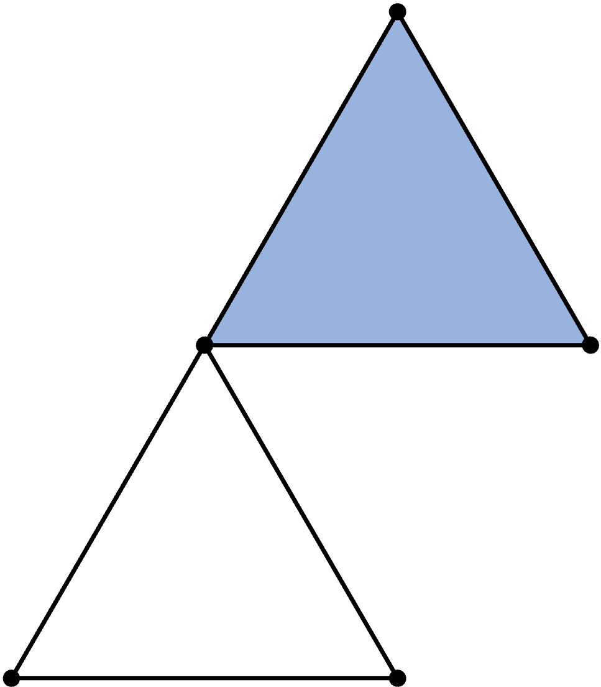
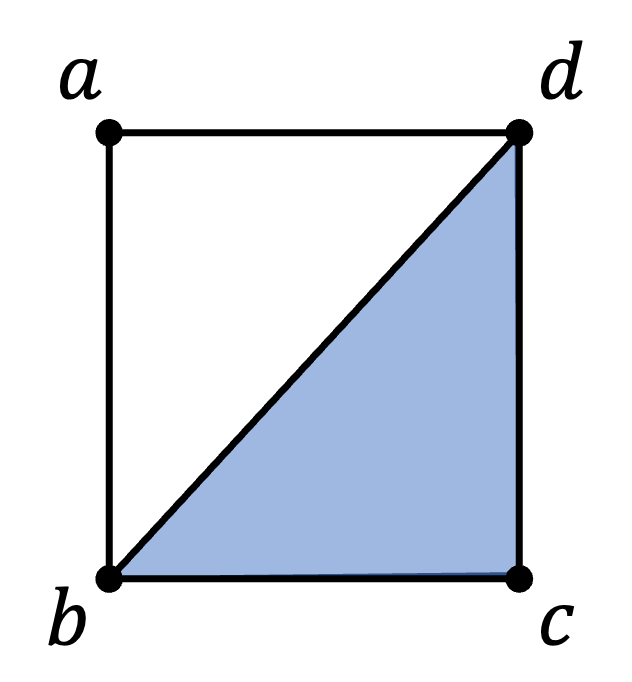

## 2. Homology

> 📌 **핵심 Keyword**
> - **체인 모듈** : 심플렉스 간에 연산을 정의해 만든 벡터공간.
> - **바운더리 오퍼레이터** : $k$-심플렉스를 그것을 둘러싼 $(k-1)$-심플렉스들의 합으로 대응시키는 선형변환.
> - **호몰로지** : 심플리셜 컴플렉스가 가진 $k$차원 구멍에 대한 구조.
> 

### §. 2.1.) Chain module

[지난 포스팅](https://velog.io/@shlee0125/TDA%EC%9D%98-%EA%B8%B0%EC%B4%88-01.-Simplicial-Complex)에서는 데이터를 기하학적으로 표현하기 위해 심플리셜 컴플렉스라는 개념을 사용한다고 배웠습니다. 
특히 심플리셜 컴플렉스를 통해 알고싶은 기하학적 정보는 **연결성**과 관련되어 있다고 했습니다.
이번 포스팅에서는 연결성에 의해 정의되는 기하학적 특징은 무엇인지, 그것을 어떻게 효과적으로 계산할 수 있는지 나타내는 도구를 배울 것입니다.

심플리셜 컴플렉스 $K$가 주어졌다고 합시다.
자연수 $k$에 대하여, $\Sigma_k$를 $K$에 존재하는 $k$-심플렉스들의 집합이라고 합시다.
예를들어, $\Sigma_0$는 꼭짓점들만 들어있는 집합, $\Sigma_1$는 변들만 들어있는 집합일 것입니다.

이 집합들은 그저 집합일 뿐, 아무런 구조가 없습니다.
수학자들은 이런 집합 위에 적절한 구조를 생각하여 유용한 정보를 얻는 방법을 많이 사용합니다.
특히 이런 집합 위에 벡터공간 구조를 적절히 줘서 선형대수학이 잘 작동하도록 하는 방법은 굉장히 유용하며 강력한 도구입니다.
그러나 이 이론을 설명하고자 하면 수학과 대학원 1학년 수준의 대수학을 들고와야 하므로 여기선 직관적으로 설명만 하도록 하겠습니다.

$k$-컴플렉스들의 집합 $\Sigma_k$에 덧셈을 **두 $k$-컴플렉스를 병렬배치(Juxtaposition)하는 것**이라고 나이브하게 정의해보겠습니다.
이 연산이 직관적으로 작동하는 방법은 아래 **Example 2.1**에 설명되어 있습니다.
심플리셜 컴플렉스들의 연산을 위와 같이 정의하면, 연산이 닫혀있게 하기 위해서 집합은 더욱 커져야 합니다. 
즉 $\Sigma_k$의 원소들을 기본 단위(basis)로 해서 이들의 합으로 만들 수 있는 모든 조합을 포함하는 집합이어야 합니다.
정확히 말하자면, 계수가 $0$ 또는 $1$인 선형결합 
$$
a_0x_1 + a_1x_1 + \cdots + a_nx_n \; (a_i \in \left\{0,1\right\}, x_i \in \Sigma_k)
$$
을 모두 포함하는 집합이어야 합니다.
이때, 계수가 2가 되면 0이 되도록 합니다. 
이렇게 만들어진 새로운 집합은 수학적으로 계수(스칼라)가 유한체 $\mathbb{F}_2 = \left\{0,1\right\}$인 벡터공간이 됩니다.
이러한 공간을 **체인 모듈**(Chain module)이라고 합니다.

> ***Definition 2.1) Chain Module***
> 
> 주어진 심플리셜 컴플렉스 $K$에 대하여, $k$-심플렉스들의 집합을 $\Sigma_k$라고 하자. 
> $\Sigma_k$를 기저(basis)로 하고, $\mathbb{F}_2 = \left\{0,1\right\}$를 계수로 하는 벡터 공간
> $$
>C_k(K) = \left\{a_1x_1 + \cdots +a_nx_n : a_i \in\mathbb{F}_2, x_i \in \Sigma_k  \text{ for all } i \right\}
> $$
> 을 $K$의 **$k$-체인 모듈**(*k*th Chain module)라고 한다.
> 
> $C_k(K)$ (또는 $C_k$로 표기)의 원소 $\sigma = a_1x_1 + \cdots + a_nx_n$을 **$k$-체인**($k$-chain)이라고 부른다.
>

>***Remark) Free module theory (읽지 마세요.)***
>
><figure align = "center">
>    
>    </a>
>    <figcaption><b>뒤로가기 누를까?</b></figcaption>
></figure>
>
> 수학적으로 위와 같이 집합 $X$으로부터 만들어진 벡터공간을 $X$로부터 생성된 프리 $\mathbb{F}_2$-모듈(Free $R$-module)이라고 부릅니다.
> 더욱 일반적으로, 임의의 환(ring) $R$과 집합 $X$에 대하여, $X$의 원소만큼의 직접합(direct sum) $\oplus_{X} R$과 $R$-가군 동형($R$-module isomorphic)인 $R$-가군 $F$가 존재하며, 이러한 $R$-모듈 $F$를 **$X$에 의해 생성된 프리 $R$-모듈**(Free $R$-module)이라고 부릅니다.
>
> TDA를 일반화된 이론으로 다루는 문헌들에서는 체인 벡터스페이스 대신 계수 환을 $\mathbb{Z}$로 택하여, 가환군을 생각해 체인 그룹으로 두기도 합니다. [Carlsson, 2005]
> 
> 유한집합에 의해 생성된 프리 모듈은 굉장히 강력한 이론들을 가지고 있습니다.
> 조금 과장을 보태서 선형대수학에서 배운 기저를 이용해서 만든 강력한 계산 도구들(행렬 이론)과 이론(선형변환 이론)들을 전부 사용할 수 있습니다.
> 이 이론에 대해 이야기하고 싶은 것은 너무 많지만, 참고도서만 남겨둔 채 먼 미래로 기약하기로 하겠습니다.
> 
> **[Reference]**
>
> 1. Introduction to Commutative Algebra (Michael Atiyah and lan G. Macdonald).
> 2. Abstract Algebra (Dummit and Foote)
> 3. Algebra (Thomas W. Hungerford)
> 

>  ***Example 2.1) Chain Module***
> 
>아래의 그림과 같이 시각화되는 심플리셜 컴플렉스 $K$가 있다고 합시다.
>그러면 이 경우 $\Sigma_0 = \left\{\left\{a\right\}, \left\{b\right\} ,\left\{c\right\}\right\}$, $\Sigma_1 = \left\{\left\{a,b\right\}, \left\{b,c\right\} ,\left\{c,a\right\}\right\}$, $\Sigma_2 = \left\{\left\{a,b,c\right\}\right\}$ 입니다.
><figure align = 'center'></figure>
>
> 이제 $k$-컴플렉스들의 집합 $\Sigma_k$에 덧셈을 **두 $k$-컴플렉스를 병렬배치(Juxtaposition)하는 것**이라고 나이브하게 정의해보겠습니다.
> 예를들어, 두 꼭짓점 $\left\{a\right\} ,\left\{b\right\}\in \Sigma_0$의 덧셈 $\left\{a\right\}+\left\{b\right\}$의 결과는 아래의 그림과 같이 두 개의 점이 병렬배치된 그림으로 시각화할 수 있습니다.
><figure align = 'center'></figure>
>
> 유사하게, 두 변 $\left\{a,b\right\} ,\left\{b,c\right\}\in \Sigma_1$의 덧셈 $\left\{a,b\right\} + \left\{b,c\right\}$는 아래의 그림과 같이 두 개의 변이 병렬배치되어 연결된 그림으로 시각화할 수 있습니다.
> <figure align = 'center'></figure>
> 
> 특별히 같은 $k$-심플렉스끼리의 합은 0이 됩니다. 
> 이 경우에는 같은 심플렉스가 겹치면서 사라진다고 생각하면 좋습니다.
> 

체인 모듈을 정의하는 것에 고급 수학이론이 다소 첨가되어 어려움이 있었을 것입니다.
이 정의를 어떻게 구성하는 데에 완벽히 이해할 필요는 없습니다.
그 이론적 구성을 잘 쌓아둔 수학자들을 믿고 감사하며, 예제로서 현상만 이해하는 것을 권해드립니다.

체인 모듈을 정의한 이유는 단순히 기하학적 대상이었던 심플리셜 컴플렉스에 **선형대수학**을 응용하기 위함입니다.
이제부터는 정말 선형대수학 이야기만 있을 것입니다.
선형대수학에 익숙하신 여러분은 마치 **한 조각 케이크🍰 먹듯** 손쉽게 이 포스팅의 마지막까지 읽으실 수 있을 것입니다.

<figure align = "center">
    
    </a>
    <figcaption><b>따악 한 섹션만 더 읽어주십시요. 반드시 이해하실 수 있도록 쉽게 설명해드리겠습니다!!</b></figcaption>
</figure>

### §. 2.2.) Boundary operator

벡터공간 이야기가 나온 김에 선형대수학의 주요 개념들과 정리 몇 가지를 나열해보겠습니다.

>***Remark) 선형대수학 사전***
> - **Vector Space** : 선형대수학에서 다루는 대수적 구조. 덧셈과 스칼라곱 두 가지 연산이 잘 정의된 공간이다. 
> - **Basis** : 벡터공간의 모든 원소를 표현할 수 있는 대표들. 벡터 공간의 모든 원소들은 기저들의 선형결합에 의해 표현된다.
> - **Dimension** : 한 벡터공간의 특징을 표현할 수 있는 수. 기저의 원소 개수를 그 벡터공간의 차원이라고 한다. 
> - **Linear map (Linear Transformation)** : 두 벡터공간 사이의 함수로서, 덧셈과 스칼라곱 연산을 보존한다. 
> - **Linear Extension Theorem** : 선형변환은 정의역의 모든 원소를 대응시켜줄 필요없이, 기저들의 대응만 맞춰줘도 전체를 알 수 있다.
> - **Matrix Representation Theorem** : 선형변환은 행렬로 표현할 수 있다. 

 
이제 심플리셜 컴플렉스를 꼭짓점, 변, 면으로 따로 떼어서 벡터공간 $C_0(K), C_1(K), C_2(K), \ldots$을 만들었습니다.
이들을 잘 분석하면 심플리셜 컴플렉스에 대한 유용한 정보를 많이 알 수 있을 것입니다.

선형대수학에서 벡터공간을 만나면 가장 먼저 **기저와 차원**을 확인했었습니다.
$k$-체인 모듈 $C_k$의 **기저**(basis)는 정의했던 대로 $\Sigma_k$의 원소들입니다. 
따라서 $k$-체인 모듈의 **차원**(dimension)은 $|\Sigma_k|$이며, 이는 심플리셜 컴플렉스 $K$의 $k$-심플렉스들의 수와 같습니다.

표기법 하나를 정하고 가겠습니다.
>  ***Notation)***
> 
> $k$-심플렉스 $\sigma \in \Sigma_k$가 $k+1$개의 꼭짓점 $v_0, v_1,\ldots, v_k \in \Sigma_0
$에 의해 결정된다고 하자.
> 즉, $\sigma = \cup_{i=0}^k v_i\in \mathcal{S}$이다. 
> 이 경우 $\sigma = [v_0,v_1,\ldots,v_k]$로 표기한다.
> 이때 $\sigma$에 대응하는 $k$-체인은 표기를 남용하여, 그대로 $\sigma (\in C_k)$로 표기한다.
>
> $\sigma = [v_0,v_1\ldots, v_k]$에서 꼭짓점 $v_i$를 제거해 만들어진 $(k-1)$-심플렉스는 $[v_0,v_1\ldots, \hat{v_i},\ldots,v_k] \in C_{k-1}$로 표기한다.

이번에는 서로 다른 체인 모듈간의 관계를 알기 위해 선형변환을 만들어볼 것입니다.
선형대수학의 가장 중요한 정리 중 하나는 선형변환을 결정할 때 일반 함수처럼 정의역에 있는 모든 원소에 대한 대응을 결정해줄 필요없이, 정의역의 기저가 어디로 대응될지만 결정해주면 된다는 **Linear Extension Theorem** 입니다.

>  ***Theorem 2.1) Linear Extension Theorem***
> 
> $\left\{v_1, \ldots, v_n\right\}$, $\left\{w_1, \ldots, w_n\right\}$을 각각 벡터공간 $V$와 $W$의 기저라고 하자.
> 그러면 각 $i=1,2,\ldots,n$에 대하여, 
>
> $$
>Tv_i = w_i
>$$
> 가 되게 하는 선형변환 $T : V\rightarrow W$가 유일하게 존재한다.
> 
> [참고 : Theorem 3.5 in Linear algebra done right (Sheldon Axler) 그외 임의의 선형대수학 교과서]

위 정리에 따르면, 우리는 체인 모듈의 기저가 되는 $k$-심플렉스를 어디로 대응시켜줄지 결정하기만 하면 선형변환을 정의할 수 있습니다.
이제 체인모듈들을 어떤 관계로 관찰할지 상상력만 발휘하면 이론과 계산 도구는 이미 다 준비된 셈입니다.

똑똑한 수학자들은 높은 차원의 심플렉스는 낮은 차원의 심플렉스들로 둘러쌓여 있다는 점에 주목했습니다. 
예를들어서, 2차원 심플렉스 삼각형면은 1차원 심플렉스인 세 변으로 둘러쌓여 있습니다.
이들 세 변은 삼각형의 **테두리**(Boundary)라고 할 수 있습니다.
그래서 높은 차원의 심플렉스를 그것을 둘러싼 경계로 대응시키는 관계를 생각하기로 했습니다.
이를 **바운더리 오퍼레이터**(Boundary operator)라고 부릅니다.

바운더리 오퍼레이터의 정의는 다음과 같습니다.

>  ***Definition 2.2) Boundary Operator***
> 
> 심플리셜 컴플렉스 $K$의 연속한 체인모듈 $C_k, C_{k-1}$들에 대하여, 선형변환 $\partial_k : C_k \rightarrow C_{k-1}$를 다음과 같이 정의하자.
> $$
>\partial_k \sigma = \sum_{i=0}^k [v_0,\ldots, \hat{v_i} \ldots, v_k]\;\; \text{ for all } \sigma = [v_0,\ldots,v_k] \in \Sigma_k$$ 
>
>여기서 각 $\sigma = [v_0,\ldots, v_k]$는 $C_k$의 기저가 되므로, Theorem 2.1 (Linear Extension Theorem)에 의해 이러한 선형변환 $\partial_k$는 유일하게 존재한다.

>  ***Example 2.2) Boundary Operator***
> 
>세 꼭짓점 $v_0, v_1, v_2$로 결정되는 2-심플렉스 $\sigma = [v_0,v_1,v_2] \in C_2(K)$가 있다고 합시다. 
>$\sigma$는 세 변 $[v_0,v_1], [v_1,v_2],[v_2,v_0]$로 둘러쌓여 있습니다.
>따라서 바운더리 오퍼레이터 $\partial_2$에 대한 $\sigma$의 이미지는 $[v_0,v_1] + [v_1,v_2] + [v_1,v_2] \in C_1$입니다.
> 아래의 그림을 보시면 시각적으로 바운더리 오퍼레이터가 어떤 작용을 하는지 관찰할 수 있습니다.
><figure align = 'center'></figure>
> 

위 예제에서 살펴볼 수 있듯, 바운더리 오퍼레이터는 심플렉스를 입력하면 그 테두리를 뱉어주는 함수입니다.
이러한 바운더리 오퍼레이터들에 의해서 체인 모듈들은 하나의 수열처럼 연결시킬 수 있습니다.
이러한 나열을 **체인 컴플렉스**(Chain Complex)라고 합니다.

지금까지의 내용을 정리해봅시다.
1. 데이터의 기하학적 특징을 관찰하기 위해 심플리셜 컴플렉스 형태로 표현했습니다.
2. 심플리셜 컴플렉스를 분석하기 위해 각 차원별 컴플렉스로 분리해 체인모듈이라는 벡터공간을 생각했습니다.
3. 체인모듈들을 바운더리 오퍼레이터로 연결시켰습니다.

이제 남은 일은 이 관계로부터 구체적으로 기하학적 특징을 계산해내기만 하면 됩니다.
그것이 다음 섹션에서 다룰 **호몰로지**(Homology)입니다.

이름부터 무서운 호몰로지에 대해 이야기하기에 앞서, 지금까지 논의에서 선형대수학을 적극적으로 사용하였는데 이렇게 하였을 때 얻는 장점에 대해 잠시만 생각해보겠습니다.

우리는 선형대수학을 이용해 우리의 직관 속에 있던 **심플렉스를 넣으면 그 테두리를 뱉어주는 함수**를 쉽게 정의할 수 있었습니다.
선형대수학이 가진 또 하나의 강력한 힘은 **선형변환을 행렬로 표현할 수 있다**는 점입니다.
선형변환은 순전히 인간의 언어로 표현된 규칙입니다.
그러므로 이를 컴퓨터에게 가르쳐주기란 쉽지 않을 것입니다.
그러나 이를 행렬로 표현해 숫자들의 나열로 컴퓨터에게 입력해준다면, 컴퓨터는 이를 쉽게 이해하며 사람이 하기 어려운 복잡한 계산도 줄곧 해냅니다.

이 점을 응용하면 복잡하고 큰 데이터에 대한 기하학적인 성질을 분석하는 일도 컴퓨터에게 맡길 수 있게 됩니다.
이것이 TDA가 데이터 분석에 응용될 수 있는 실용적인 이유입니다.

<figure align = "center">
   
    </a>
    <figcaption><b>그래서 교수님들이 선형대수학을 그렇게 공부하라고 하셨었구나?!</b></figcaption>
</figure>

### §. 2.3.) Homology

선형변환을 정의하고 나면 숨쉬는 것처럼 해야할 일은 **커널**(Kernel)과 **이미지**(Image)를 구하는 것입니다.
참고로 커널의 정의는 어떤 선형변환에 의해 0으로 보내지는 정의역의 원소들의 집합이고, 이미지의 정의는 어떤 선형변환에 의해 보내질 수 있는 모든 공역의 원소들의 집합입니다.
행렬의 언어로 이야기하자면, **영공간**(Null space)와 **열공간**(Column space)를 구하는 것입니다.

바운더리 오퍼레이터의 커널과 이미지는 기하학적인 특징 때문에 특별히 각각 **사이클 그룹**과 **바운더리 그룹**이라고 부릅니다.

>  ***Definition 2.4) Cycle group and Boundary group***
> 
> 각 자연수 $k$에 대하여, 
>$Z_k = \ker \partial_k$를 **$k$차 사이클 그룹**($k$th cycle group), $B_k = \text{im}\partial_{k+1}$를 **$k$차 바운더리 그룹**($k$th boundary group)이라고 부른다.
>
> $Z_k$의 원소를 **$k$차 사이클**($k$-cycle)이라고 부르고, $B_k$의 원소를 **$k$차 바운더리**($k$-boundary)라고 부른다.
>
>

>  ***Example 2.3) Cycle and Boundary***
> 
>[지난 포스팅](https://velog.io/@shlee0125/TDA%EC%9D%98-%EA%B8%B0%EC%B4%88-01.-Simplicial-Complex)의 Example 1.1에서 정의했던 삼각형 모양의 심플리셜 컴플렉스를 $K$라고 합시다.
> 1차 사이클 그룹 $Z_1$을 구해봅시다.
> $Z_1$은 $C_1$의 원소 $\sigma$ 중 $\partial_1\sigma = 0$이 되는 원소들의 모임입니다.
> 이때 $\sigma = t_1[a,b]+t_2[b,c]+t_3[c,a]\; (t_1, t_2, t_3 \in \mathbb{F}_2)$로 표현되므로, $\partial_1$의 선형성에 의해, 
> $$\partial_1\sigma = t_1([a]+[b]) + t_2([b]+[c])+t_3([c]+[a])\\
> =(t_1 + t_3)[a] + (t_1+t_2)[b] + (t_2+t_3)[c]
> $$
> 임을 얻습니다.
> 방정식 $(t_1 + t_3)[a] + (t_1+t_2)[b] + (t_2+t_3)[c] = 0$을 만족시키는 $\sigma = t_1[a,b]+t_2[b,c]+t_3[c,a]$를 모두 찾는 방법은 아래의 행렬방정식 해집합을 찾으면 됩니다.
> 
> $$\begin{bmatrix}1 & 0 & 1\\ 1 & 1 & 0 \\ 0 & 1 & 1\end{bmatrix}\begin{bmatrix}t_1 \\ t_2 \\ t_3\end{bmatrix} = \begin{bmatrix}0 \\ 0 \\ 0\end{bmatrix}$$
> 이는 행렬 $\begin{bmatrix}1 & 0 & 1\\ 1 & 1 & 0 \\ 0 & 1 & 1\end{bmatrix}$의 영공간을 찾는 문제와 같고, 이 행렬의 영공간의 기저로 $Z_1$의 기저를 알 수 있습니다.
> 이를통해 $Z_1$의 기저는 $[a,b]+[b,c]+[c,a]$임을 얻습니다.
> 주목할 점은, $[a,b]+[b,c]+[c,a]$는 세 변이 병치된 그림으로 시각화되며, 이들 세 변이 각각 꼭짓점을 공유하고 있으므로 하나의 사이클을 형성한다는 것입니다.
> 이러한 점에서 $Z_1$을 사이클 그룹이라고 부르는 것이 타당해 보입니다.
> 
> 이번에는 1차 바운더리 그룹 $B_1$을 구해봅시다.
> $B_1$을 구하기 위해서는 $C_2$의 기저 $[a,b,c]$가 바운더리 오퍼레이터 $\partial_2$에 의해 어디로 옮겨지는지만 알면 됩니다.
> 이미지의 기저는 정의역의 기저의 이미지들로 얻어지기 때문입니다.
> $\partial_2[a,b,c] = [a,b]+[b,c]+[c,a]$입니다. 
> 따라서 $B_1$의 기저는 $[a,b] + [b,c] + [c,a]$입니다. 
> 여기서 주목할 점은, $[a,b] + [b,c] + [c,a]$는 $C_2$의 어떤 원소에 대한 테두리가 된다는 점입니다. 
> 이는 Example 2.2에서 살펴보았었습니다.

직관적으로 어떤 도형의 테두리는 무언가 둘러싸고 있으므로 항상 사이클이 될 것입니다. 
그러나 사이클로 둘러쌓인 도형이 심플리셜 컴플렉스에 포함되어 있지 않을 수도 있습니다.
이 직관에 따르면, 바운더리 그룹 $B_k$는 사이클 그룹 $Z_k$의 부분집합이 될 것입니다.

이를 증명해주는 아주 중요한 성질이 다음 정리입니다.

>  ***Theorem 2.2)***
> 
> 각 $k$에 대하여, $\partial_k \circ \partial_{k+1} \equiv 0$이다.
> 즉, 연속된 바운더리 오퍼레이터의 합성은 영변환이다.
> 

직관적으로 위 정리는 테두리의 테두리는 0이라는 것을 의미합니다.
위 Example 2.2에서 얻은 바운더리 $\partial_2\sigma =[a,b]+[b,c]+[c,a]$에 바운더리 오퍼레이터 $\partial_1$를 작용시켜 그 결과를 계산해보세요.
수학적으로 위 정리가 시사하는 바는, $B_k = \text{im}\partial_2 \subseteq \ker\partial_1 = Z_1$이 됨을 의미합니다.
왜냐하면, $B_1$의 임의의 원소 $\tau$는 항상 $\tau = \partial_2 \sigma$ 꼴로 표현이 되고, 위 정리에 의해 $\partial_1\tau = \partial_1\partial_2\sigma = 0$이 되기 때문입니다.

드디어 **호몰로지**(Homology)를 정의할 준비가 끝났습니다.
호몰로지는 심플리셜 컴플렉스가 가진 구멍의 개수를 알 수 있게 해줍니다.
이때 구멍의 의미는 조금 더 넓은 의미로, 0차원 구멍은 **연결 성분**(Connected component)를, 1차원 구멍은 **루프**(Loop)를, 2차원 구멍은 **공허**(Void)를 의미합니다.

논의를 쉽게 하기 위해 우리가 평소에 사용하는 구멍과 의미가 가장 가까운 1차원 구멍을 찾는 방법을 생각해봅시다.
아래와 같은 심플리셜 컴플렉스가 있다고 합시다.

<figure align = 'center'>

</figure>

이 그림에서 우리는 구멍이 하나가 있다고 생각합니다.
이를 어떻게 수학적으로 정의할 수 있을까요?

위 그림에서 두 개의 삼각형이 있지만, 위쪽 삼각형은 세 변이 하나의 면으로 연결되어 있고 아랫쪽 삼각형은 세 변이 면으로 연결되어 있지는 않습니다.
따라서 이 심플리셜 컴플렉스에 2-심플렉스는 위쪽 삼각형의 면에 해당하는 것 하나만 존재합니다.
이 면에 대해 바운더리 오퍼레이터를 사용하면 위쪽 삼각형에 대한 테두리에 해당하는 $C_1$의 원소를 말해줄 것입니다.
이 테두리는 구멍이 뚫리지 않은 **연결된** 1-심플렉스들의 관계를 말해줍니다.

한편, 이 심플리셜 컴플렉스에 1-사이클은 위쪽 삼각형의 세 변과 아랫쪽 삼각형의 세 변 두 가지가 나타날 수 있습니다. 
사이클은 그 기하학적 특성상 구멍이 될 수 있는 가장 대표적인 후보들입니다.

그런데 앞서 살펴본 바에 따라 테두리는 사이클이 되므로, 사이클들 중에는 구멍이 아닌 것들이 있습니다.
이를 걸러내는 방법은 사이클들 중에서 테두리인 것들을 빼는 것입니다.

이렇게 얻어진 구멍들로 만들어진 공간을 **호몰로지**라고 부릅니다.

>  ***Definition 2.5) Homology***
> 
> 각 자연수 $k$에 대하여, 
> 심플리셜 컴플렉스의 **$k$차 호몰로지**($k$th homology) $H_k(K)$는 몫공간 
> $$ 
> H_k(K) := Z_k/B_k
> $$
> 로 정의된다. 
> 

>***Remark) Betti number***
>
>$H_k(K)$의 차원은 $\beta_k(K) := \dim H_k(K)$로 표기하며, 이를 $K$의 **$k$차 베티 넘버**($k$th Betti number)라고 부른다.
> 베티 넘버 $\beta_k(K)$는 
> $$\beta_k(K) = \dim H_k(K) = \dim Z_k - \dim B_k$$
> 로 계산할 수 있다.
> 베티 넘버는 심플리셜 컴플렉스 $K$가 가진 $k$차원 구멍의 개수와 같다.
> 

호몰로지라는 이름에 굉장히 겁을 많이 먹었지만, 선형대수의 언어로 모두 설명할 수 있었습니다.
마지막으로 직접 계산할 수 있는 예제를 제시하고 포스팅을 마무리하도록 하겠습니다.

>  ***Example 2.4) Homology***
>
><figure align = 'center'>
>
></figure>
>
> 위 그림과 같이 시각화되는 심플리셜 컴플렉스 $K$가 있다고 합시다. 
> 그러면, $\Sigma_0 = \left\{[a],[b],[c],[d]\right\}$, $\Sigma_1 = \left\{[a,b],[b,c],[c,d],[d,a],[b,d]\right\}$, $\Sigma_2 = \left\{[b,c,d]\right\}$이므로, 체인모듈 $C_0, C_1, C_2$는 각각 차원이 4, 5, 1 입니다. 
>
> 이 심플리셜 컴플렉스 $K$에 대해 1차 호몰로지 $H_1(K)$를 구해봅시다.
> Example 2.3에서와 같이 선형대수학 문제를 풀면 $Z_1 = \text{span}([a,b]+[b,d]+[a,d], [b,c]+[c,d]+[b,d])$, $B_1 = \text{span}([b,c] + [c,d] + [b,d])$ 임을 구할 수 있습니다.
> (꼭 직접 해보세요!)
> 
> 그러면, $H_1(K) = Z_1/B_1 = \left\{\sigma + B_1 : \sigma \in Z_1 \right\}$입니다.
> 그런데 임의의 사이클 $\sigma \in Z_1$은 
> $$
> \sigma = t_1([a,b]+[b,d]+[a,d]) + t_2([b,c]+[c,d]+[b,d])
> $$
> 로 표현이 가능하고, 
> $$
> \sigma - t_1([a,b]+[b,d]+[a,d]) = t_2([b,c]+[c,d]+[b,d]) \in B_1
> $$
> 이므로, 
> $\sigma + B_1 = t_1([a,b]+[b,d]+[a,d]) + B_1$이 됩니다.
> 따라서 $H_1(K) = \text{span}([a,b] + [b,d]+[a,d] + B_1)$ 이 됩니다.
>
> 이를 해석하면, 심플리셜 컴플렉스 $K$에는 $[a,b]+[b,d]+[a,d]$로 표현되는 1차원 구멍이 1개 존재한다는 것입니다.
> 
> 만약, 어떤 구멍인지는 궁금하지 않고 구멍의 개수가 몇 개인지만 궁금하다면 단순히 $Z_1$의 차원(=2)에서 $B_1$의 차원(=1)을 빼서 베티 넘버만 쉽게 구할 수도 있습니다.

오늘은 호몰로지에 대하여 다루어 보았습니다.
찾아보니 수학과 학생을 고통받게 하려면, "호몰로지가 뭐죠?" 라고 질문하면 된다고 하더군요.
여기까지 읽으신 여러분은 적어도 호몰로지가 선형대수학을 이용해서 **심플리셜 컴플렉스의 구멍**을 계산해준다는 것정도는 설명하실 수 있게 될 것입니다.

최대한 쉽게 써보려고, 그리고 재밌게 써보려고 노력하였지만 역시 어려운 개념임에는 틀림이 없는 것 같습니다. 😵‍💫
한 입에 먹기엔 조금 큰 글입니다.
조금씩 나누어서 읽으시다가 씹어 삼키기 어려운 부분이 있다면 댓글로 질문을 남겨주세요.
최대한 정성껏 답변드리겠습니다 😉

다음 포스팅에서는 본격적으로 TDA의 핵심 도구인 **지속성 호몰로지**(Persistent homology)에 대하여 다루어보겠습니다.

---

> 📝 **요약 Summary**
> - 심플리셜 컴플렉스의 기하학적 특징, 특히 구멍의 개수를 계산하기 위해 호몰로지를 사용한다.
> - 호몰로지를 사용하기 위해 선형대수학을 적극적으로 사용한다.
> - 선형대수학을 이용한 덕분에 컴퓨터를 이용해 큰 데이터의 기하학적 구조를 쉽게 계산할 수 있게 된다.
> 